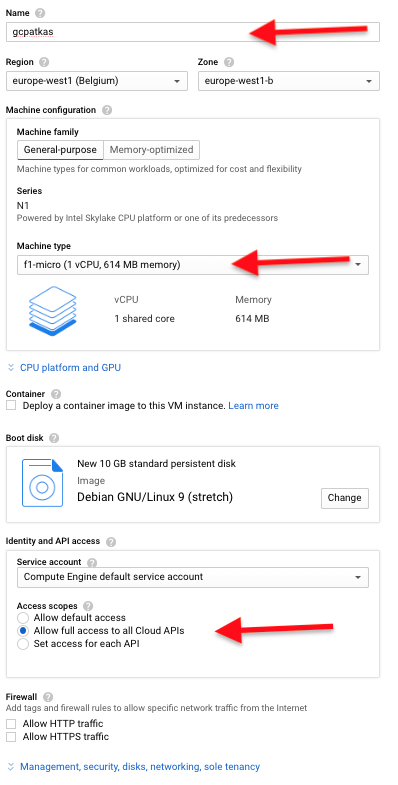

# GCP Instance Setup
* Create a micro Ubuntu 19.04 GCE VM instance in us-east4 using the instructions given here [link](https://www.google.com/url?q=https://cloud.google.com/compute/docs/quickstart-linux&sa=D&ust=1560383195254000)

* At the top left hamburger menu, select "Compute Engine" and from the sub menu. "VM Instances", like in picture below


* If you do this for the first time an initialization dialogue is shown. Like below


* When complete, click "Create".

* Fill out the form as below, but select for "Region" the same as where you MongoDB Atlas cluster is deployed. The value for "Zone" is not relevant.  Be sure to select: "Allow full access to al Cloud APIs"



* In the search box at the top, enter “Firewall” and select the matching suggestion "Firewall Rules VPC network”


* Click “Create Firewall Rule” at the top to create a new rule to open up the needed port for our new server


* Enter the following details and click “Create”:
```
Name: gcpatlasdemo
Targets: All instances in the network
Source IP ranges:  0.0.0.0/0
Protocols and ports:  
    tcp: 8088-8089
``` 


* [Make sure to do the API Vision setup](GCPVisionSetup.md)

* Go back to the Compute Engine page to list all VM instances.


* After your instance is created, SSH to your instance by clicking on the SSH button of your instance.


* You should see a CloudShell window similar to this open...


* Run the following commands:

```
  sudo apt-get update
  sudo apt-get install -y python3-pip
  sudo apt-get install -y git
  git clone https://github.com/eugenebogaart/MongoDBAtlas-GCP-AIMLv2.git
  cd MongoDBAtlas-GCP-AIMLv2/FinishedSampleCode
  python3 -m pip install -r requirements.txt
```

Please note some people (on Windows with Firefox but it does apply to other browsers) that they cannot copy/paste the entire block above into Cloud Shell in one go. They must copy/paste line-by-line.  

Or use the below single line.

```
  sudo apt-get update ; sudo apt-get install -y python3-pip ; sudo apt-get install -y git ; git clone https://github.com/eugenebogaart/MongoDBAtlas-GCP-AIMLv2.git ; cd MongoDBAtlas-GCP-AIMLv2/FinishedSampleCode ; python3 -m pip install -r requirements.txt
```
 

* Edit the `gcpcreds.json` to have the credentials of the json file you downloaded above
* Edit `settings.cfg` to have the Atlas connection string created above
* Run `python3 runner.py` to start the application
* Visit the URL of your server port 8088 and you should see a web page
  * e.g. if the public IP address of your Google Cloud instance is 12.23.45.56, open a browser and visit http://12.23.45.56:8088
* Try to enter an url in the entry field to get analysed by Google Vision API
  * https://storage.googleapis.com/demo-visionapi-atlas/Marketing/eiffel-tower.jpg


